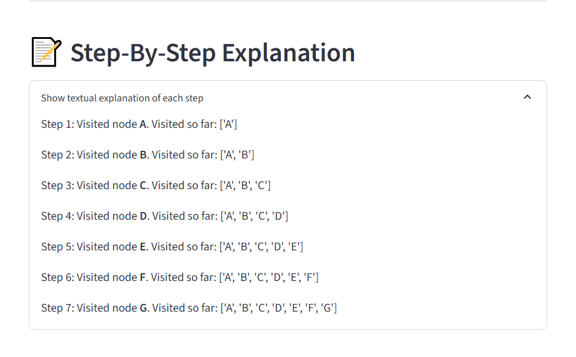

# BFS vs DFS Visualizer - Interactive Visualization

## Project Overview

This project is an interactive web application that implements and visualizes two fundamental graph traversal algorithms—**Breadth-First Search (BFS)** and **Depth-First Search (DFS)**—developed as part of the Algorithms and Programming II course at Fırat University, Software Engineering Department.

## Algorithm Description

### Problem Definition

Graph traversal is the process of visiting all the vertices (nodes) of a graph in a systematic order. It is used in numerous applications such as pathfinding, connectivity checks, and network analysis.

### Mathematical Background

A graph $G = (V, E)$ consists of a set of vertices $V$ and a set of edges $E$. In an unweighted graph:

* **BFS** explores neighbors level by level, using a queue (FIFO).
* **DFS** explores as deeply as possible along each branch before backtracking, using a stack (LIFO) or recursion.

### Algorithm Steps

#### Breadth-First Search (BFS)

1. Initialize a queue and enqueue the start node.
2. Mark the start node as visited.
3. While the queue is not empty:

   1. Dequeue a node $u$.
   2. For each neighbor $v$ of $u$ not yet visited:

      1. Mark $v$ as visited.
      2. Enqueue $v$.

#### Depth-First Search (DFS)

1. Initialize a stack (or use recursion) and push the start node.
2. Mark the start node as visited.
3. While the stack is not empty:

   1. Pop a node $u$.
   2. For each neighbor $v$ of $u$ (in reverse order if using a stack) not yet visited:

      1. Mark $v$ as visited.
      2. Push $v$ onto the stack.

### Pseudocode

```plaintext
function BFS(graph, start):
    create empty set visited
    create queue Q
    enqueue start onto Q
    add start to visited
    while Q not empty:
        u = dequeue Q
        for each v in graph[u]:
            if v not in visited:
                enqueue v onto Q
                add v to visited

function DFS(graph, start):
    create empty set visited
    create stack S
    push start onto S
    while S not empty:
        u = pop S
        if u not in visited:
            add u to visited
            for each v in graph[u] in reverse order:
                push v onto S
```

## Complexity Analysis

### Time Complexity

* **BFS:** $O(V + E)$
* **DFS:** $O(V + E)$

### Space Complexity

* **BFS:** $O(V)$ auxiliary (visited set + queue)
* **DFS:** $O(V)$ auxiliary (visited set + recursion/stack)

## Features

* **Graph Selection:** Linear Graph, Binary Tree, Tree with Uneven Depths, Directed Graph, or Cyclic Graph.
* **Start Node:** Choose any existing node as the starting point.
* **Algorithm Choice:** BFS or DFS traversal.
* **Animation Speed:** Adjustable step delay.
* **Animated Traversal:** Nodes highlight in green as visited.
* **Textual Explanation:** Step-by-step log of visits.
* **Test Cases:** Predefined suite covering normal, edge, and cyclic graphs.
* **Complexity Analysis:** Big O time and space complexity display.

## Screenshots
---

---
*Select graph type, start node, algorithm, and step delay.*
---

---
*Nodes animate in sequence during traversal.*
---

---
*Expandable list of step-by-step descriptions.*
---

---
*Test suite results showing Pass/Fail outcomes.*
---

---
*Big O analysis for BFS and DFS.*

## Installation

### Prerequisites

* Python 3.8 or higher
* Git
* pip

### Setup Instructions

1. **Clone the repository:**

   ```bash
   git clone https://github.com/yourusername/bfs-dfs-visualizer.git
   cd bfs-dfs-visualizer
   ```
2. **(Optional) Create and activate a virtual environment:**

   ```bash
   python3 -m venv venv
   source venv/bin/activate   # macOS/Linux
   venv\Scripts\activate    # Windows
   ```
3. **Install dependencies:**

   ```bash
   pip install -r requirements.txt
   ```
4. **Run the application:**

   ```bash
   streamlit run app.py
   ```

## Usage Guide

1. Launch the app with `streamlit run app.py`.
2. Use the sidebar to select graph type, start node, algorithm, and delay.
3. Click **Run Traversal** to start.
4. Watch the animated graph and read the textual log.
5. Scroll down to view test case results and complexity analysis.

## Implementation Details

* **algorithm.py:** BFS and DFS implementations with step logging.
* **app.py:** Streamlit application orchestrating UI and visualization.
* **utils.py:** Graph constructors and plotting utilities.
* **test\_algorithm.py:** Unit tests validating traversal correctness.

### Code Highlights

```python
def bfs(graph, start):
    from collections import deque
    visited = set()
    queue = deque([start])
    steps = []
    while queue:
        node = queue.popleft()
        if node not in visited:
            visited.add(node)
            steps.append(list(visited))
            for nbr in graph[node]:
                if nbr not in visited:
                    queue.append(nbr)
    return steps
```

## Testing

Run the full test suite:

```bash
python -m unittest test_algorithm.py
```

### Test Cases

* Empty graph returns an empty traversal.
* Single-node graph returns the start node only.
* Various linear, tree, and cyclic graphs ensure no infinite loops.

## Live Demo

A live demo is available at: [https://bfs-vs-dfs-visualizer---interactive-visualization-9yjpkgbm7ket.streamlit.app/](https://bfs-vs-dfs-visualizer---interactive-visualization-9yjpkgbm7ket.streamlit.app/)

## Limitations and Future Improvements

### Current Limitations

* Limited to predefined sample graph types.
* Does not support weighted or undirected edge weights.
* Single start node only, no multiple-source traversal.

### Planned Improvements

* Allow custom graph input via text or file upload.
* Support weighted graphs and shortest-path visualizations (Dijkstra, A\*).
* Add undirected graph edge toggles and styling options.
* Integrate real-time performance metrics and code export.

## References and Resources

* Cormen, T. H., Leiserson, C. E., Rivest, R. L., & Stein, C. (2009). Introduction to Algorithms, Chapters 22–23.
* Wikipedia: [Breadth-First Search](https://en.wikipedia.org/wiki/Breadth-first_search), [Depth-First Search](https://en.wikipedia.org/wiki/Depth-first_search)
* Streamlit Documentation: [https://docs.streamlit.io](https://docs.streamlit.io)
* NetworkX Documentation: [https://networkx.org](https://networkx.org)

## Author

* **Name:** Muhammed Elubeyid
* **Student ID:** 220543603
* **GitHub:** MuhammedElubeyid

## Acknowledgements

Thanks to Assoc. Prof. Ferhat UÇAR for guidance on this project.

---

Developed for the Algorithms and Programming II course at Fırat University, Software Engineering Department.
